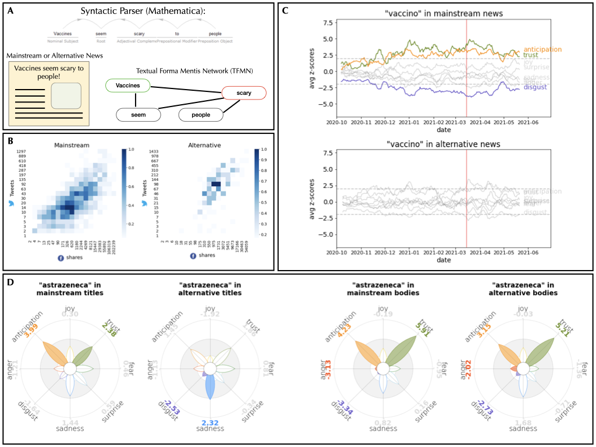
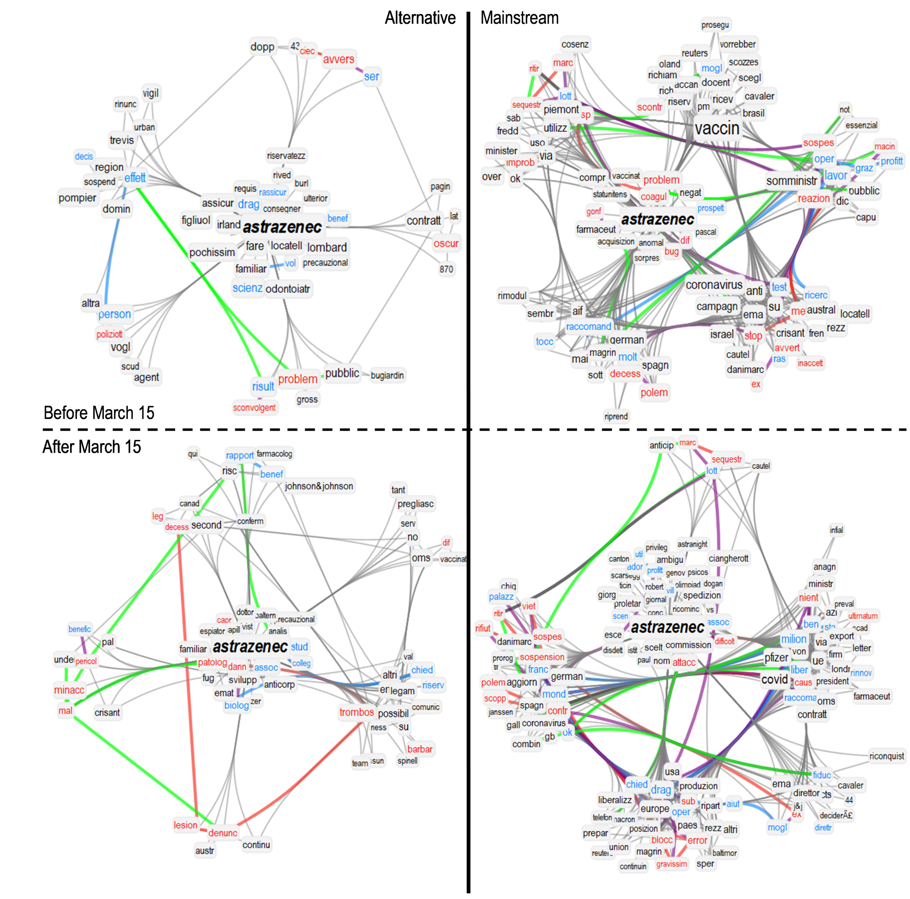
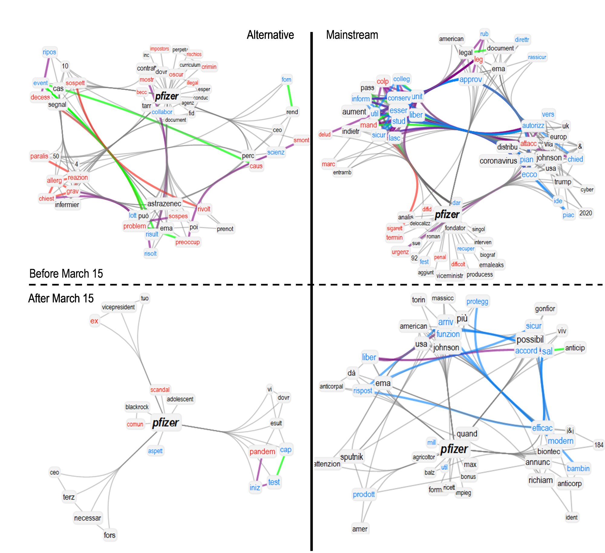

Data for 

# Writing about COVID-19 vaccines: Emotional profiling unravels how mainstream and alternative press framed AstraZeneca, Pfizer and vaccination campaigns

This repository hosts the data for _"Writing about COVID-19 vaccines: Emotional profiling unravels how mainstream and alternative press framed AstraZeneca, Pfizer and vaccination campaigns"_, our submission currently under review. A pre-print is available [here](https://arxiv.org/abs/2201.07538). 

> COVID-19 vaccines have been largely debated by the press. To understand how mainstream and alternative media debated vaccines, we introduce a paradigm reconstructing time-evolving narrative frames via cognitive networks and natural language processing. We study Italian news articles massively re-shared on Facebook/Twitter (up to 5 million times), covering 5745 vaccine-related news from 17 news outlets over 8 months. We find consistently high trust/anticipation and low disgust in the way mainstream sources framed "vaccine/vaccino". These emotions were crucially missing in alternative outlets. News titles from alternative sources framed "AstraZeneca" with sadness, absent in mainstream titles. Initially, mainstream news linked mostly "Pfizer" with side effects (e.g. "allergy", "reaction", "fever"). With the temporary suspension of "AstraZeneca", negative associations shifted: Mainstream titles prominently linked "AstraZeneca" with side effects, while "Pfizer" underwent a positive valence shift, linked to its higher efficacy. Simultaneously, _thrombosis_ and fearful conceptual associations entered the frame of vaccines, while _death_ changed context, i.e. rather than hopefully preventing deaths, vaccines could be reported as potential causes of death, increasing fear. Our findings expose crucial aspects of the emotional narratives around COVID-19 vaccines adopted by the press, highlighting the need to understand how alternative and mainstream media report vaccination news.

In this paper we analyzed more than 5000 Italian articles that contained "vaccine" or one name of vaccines in their titles, during a 8 months observation period between October 2020 and May 2021. We extracted the [semantic frames](https://www.mdpi.com/2227-7102/10/1/17) surrounding key words like "vaccine", highlighting the most recurrent and important semantic associations; we also displayed the [emotional characterization](https://journals.plos.org/plosone/article?id=10.1371/journal.pone.0256503) of the semantic frames linked to specific concepts. 

## The Graphical Abstract... 

## ...or a few highlights of the paper 👇

**Figure 1:** **(A)** Mechanisms of data creation and key differences highlighted by them in mainstream and alternative news. Data is grouped by weeks. Figure 1 (A) highlights how our approach gives structure to knowledge in news. --- **(B)** Each tile _<i, j>_ is coloured after the number of urls that have been shared _i_ times on Facebook and _j_ times on Twitter. Both axes are logarithmically binned.--- **(C)** Z-scores of emotions in news that contain the word "vaccin" against a neutral sample, grouped by day and smoothed with a weekly rolling average. Mainstream news about the word "vaccin" show consistent high levels of Trust and Anticipation, conveying hope for the vaccination campaign, and significantly less Disgust. This positive leaning is not visible in alternative news. ---**(D)**  Distribution of z-scores of bodies (right) and titles (left) into the emotional frame of the word "astrazenec", divided by mainstream and alternative outlets. There is a striking difference in how titles are written by mainstream and alternative news outlets, with the latter evoking more sadness but also significantly less disgust than the former. Such a difference is not visible in the articles bodies. White filled petals represent emotions that are not significantly over- or under-represented in the corpus, if compared with a neutral baseline.

**Figure 2:** Semantic frames of tightly linked concepts around "astrazenec" in journal news titles from mainstream sources (right) and alternative sources (left), before (top) and after (bottom) the temporary suspension of 15 March 2021.

**Figure 3:** Semantic frames of tightly linked concepts around "pfizer" in journal news titles from mainstream sources (right) and alternative sources (left), before (top) and after (bottom) the temporary suspension of 15 March 2021.

**Figure 4: (A)** Fraction of news that mention ``mort'' (death) and ``trombos'' (thrombosis) in their bodies and titles over the total of mainstream news (blue) and alternative news (red), smoothed by a moving average of the last 7 days. **(B)** Distribution of emotions in the semantic frame of ``mort'' (death) in the titles of mainstream and alternative articles.

## Data 💾 

File `files_urls_social.csv` lists all the articles reviewed in this paper. It has the following structure:

  - *edgelist*: files that contain the formamentis of each article. Files are sorted by their source (Alternative/Mainstream sites) and their kind (titles or texts) into 4 subdirectories in the compressed archive `formamentis.zip`.
  - *url*: the original URL of the web article.
  - *tweets*: the number of times that article was tweeted during the observation period.
  - *facebook*: the number of times that article was posted on Facebook during the observation period.
  - *kind*: either "Mainstream" if the source is an authorable newspaper or "Alternative" if it is a disinformation blog/website.

